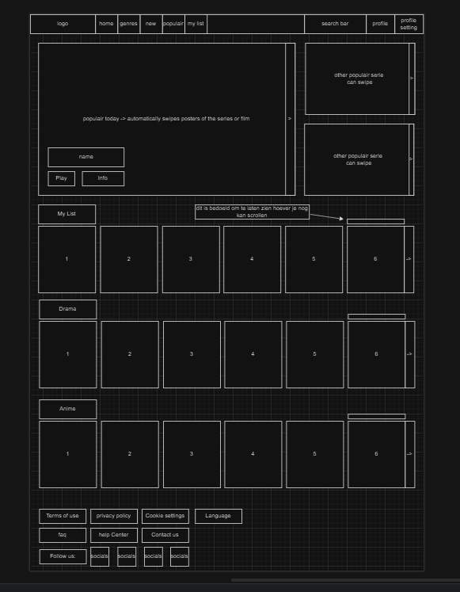

## Movie-Haven 🎥🎥🎥

Welcome to Movie Haven, your ultimate destination for discovering and exploring the world of films. This project brings you a visually appealing, interactive homepage that offers a seamless experience for movie enthusiasts, with features tailored to enhance accessibility and comfort.

## Demo 🎞️
[](Logo/demos/vOne/vidVersionOne.mp4)

> *Click the image above to watch the gameplay video.*
---
## Features

- **Advanced Search**: Effortlessly search for movies by title, genre, release year, or rating to find your next favorite film.
- **Comprehensive Movie Details**: View detailed information about each movie, including the cast, plot summary, trailers, and user ratings.
- **Fully Responsive Design**: The site adjusts seamlessly to all devices, providing a smooth experience whether you're on a desktop, tablet, or mobile phone.
- **Intuitive User Interface**: Navigate easily with a clean and modern design, featuring smooth transitions and dynamic hover effects.
- **Community Ratings**: Rate movies and share your thoughts, helping other users discover popular films or hidden gems.


## How to Run 🚀

To run the Movie-Haven project on your local machine:

1. Clone the repository:
```bash 
git clone https://github.com/yourusername/movie-haven.git
```
2. Navigate into the project directory:
 ``` bash
cd movie-haven
```
3. You can use git checkout to find the branch needed for the work at hand:
```bash 
git checkout <The name of the branch where you want to work>
```
4. You can go live using a live server by following:
```bash 
code .
```
This guarantees that you will work in Visual Studio Code.

Contributions are welcome! Feel free to fork the repository and submit a pull request to suggest improvements or report bugs.
 Here's how you can contribute:

 1. Fork the repository.
 2. Create a new branch (`git checkout -b feature-branch`).
 3. Commit your changes (`git commit -m 'Add new feature'`).
 4. Push your changes to your forked repository (`git push origin feature-branch`).
 5. Open a pull request to merge your changes into the main repository.

Join us by sharing your creativity through pull requests and issues!
---
Feel free to adjust any parts to fit your project specifics.
